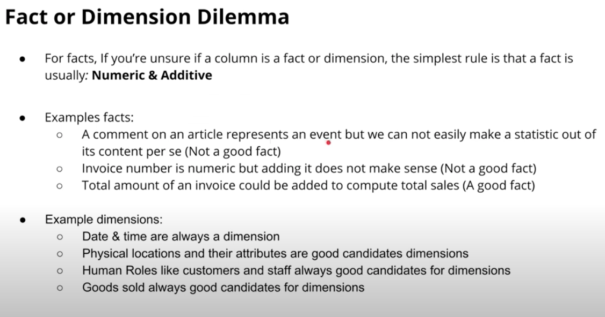
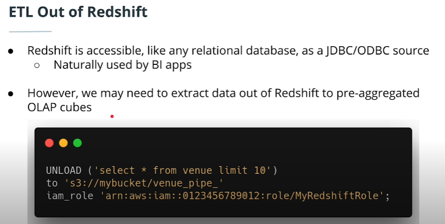
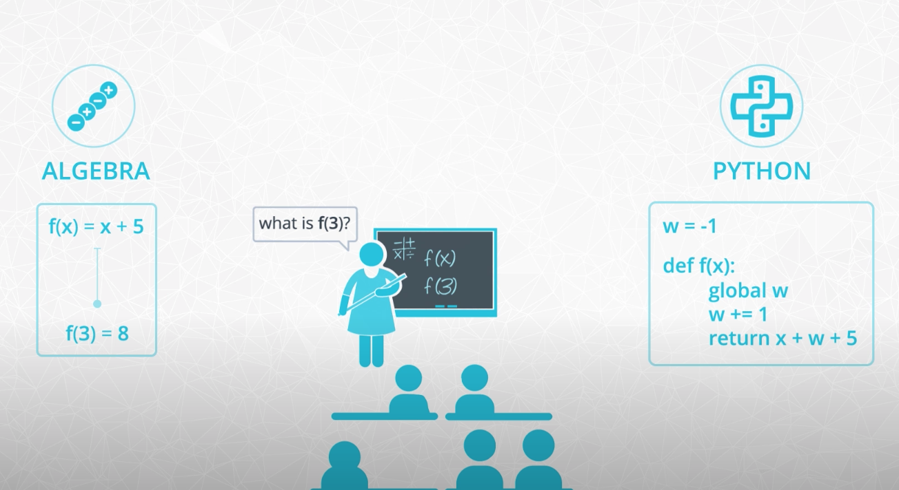
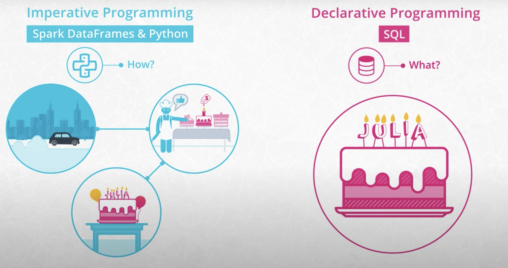
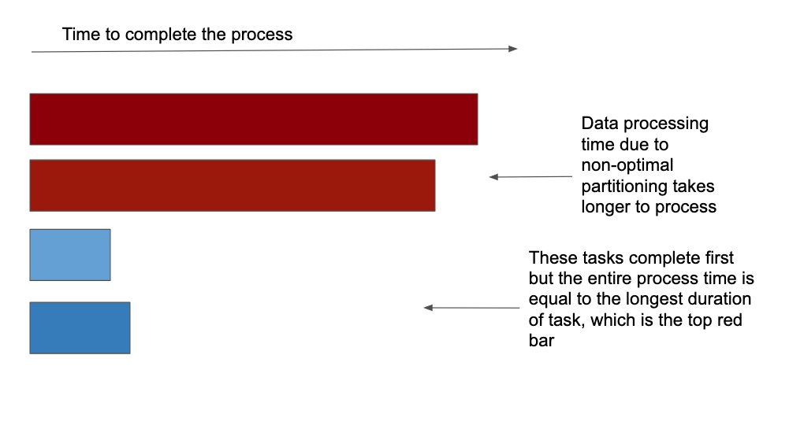

# Data Engineer Nanodegree 

## Welcome to the Nanodegree Program

### Introduction to Data Engineering

* 

* 

## Data Modeling

### Introduction to Data Modeling

* Introduction to Databases and DBMS
    * Databases: A database is a structured repository or collection of data that is stored and retrieved electronically for use in applications. Data can be stored, updated, or deleted from a database.

    * Database Management System (DBMS): The software used to access the database by the user and application is the database management system. Check out these few links describing a DBMS in more detail.

* DDL = Data Definition Language 
    * Materialize a logical data model to a database model (physical data modeling)

* 

* A schema is a collection of tables in some database terminology.

* 

    * **Flexibility for writing in SQL queries**: With SQL being the most common database query language.
    * **Modeling the data not modeling queries**
    * Ability to do **JOINS**
    * Ability to do **aggregations** (SUM, COUNT, AVG) and analytics
    * **Secondary Indexes available**: You have the advantage of being able to add another index to help with quick searching.
    * **Smaller data volumes**: If you have a smaller data volume (and not big data) you can use a relational database for its simplicity.
    * **ACID Transactions**: Allows you to meet a set of properties of database transactions intended to guarantee validity even in the event of errors, power failures, and thus maintain data integrity.
    * Easier to change to business requirements

* ACID Transactions
    * Properties of database transactions intended to guarantee validity even in the event of errors or power failures.

    * `Atomicity`: The whole transaction is processed or nothing is processed. A commonly cited example of an atomic transaction is money transactions between two bank accounts. The transaction of transferring money from one account to the other is made up of two operations. First, you have to withdraw money in one account, and second you have to save the withdrawn money to the second account. An atomic transaction, i.e., when either all operations occur or nothing occurs, keeps the database in a consistent state. This ensures that if either of those two operations (withdrawing money from the 1st account or saving the money to the 2nd account) fail, the money is neither lost nor created. Source Wikipedia for a detailed description of this example.

    * `Consistency`: Only transactions that abide by constraints and rules are written into the database, otherwise the database keeps the previous state. The data should be correct across all rows and tables. Check out additional information about consistency on Wikipedia.

    * `Isolation`: Transactions are processed independently and securely, order does not matter. A low level of isolation enables many users to access the data simultaneously, however this also increases the possibilities of concurrency effects (e.g., dirty reads or lost updates). On the other hand, a high level of isolation reduces these chances of concurrency effects, but also uses more system resources and transactions blocking each other. Source: Wikipedia

    * `Durability`: Completed transactions are saved to database even in cases of system failure. A commonly cited example includes tracking flight seat bookings. So once the flight booking records a confirmed seat booking, the seat remains booked even if a system failure occurs. Source: Wikipedia.

* When Not to Use a Relational Database
    * **Have large amounts of data**: Relational Databases are not distributed databases (by default) and because of this they can only scale vertically by adding more storage in the machine itself. You are limited by how much you can scale and how much data you can store on one machine. You cannot add more machines like you can in NoSQL databases.
    * **Need to be able to store different data type formats**: Relational databases are not designed to handle unstructured data (not true, it can handle JSON/XML).
    * Need high throughput -- fast reads: While ACID transactions bring benefits, they also slow down the process of **reading and writing data** (if you are writing it may impact reads). If you need very fast reads and writes, using a relational database may not suit your needs.
    * **Need a flexible schema**: Flexible schema can allow for columns to be added that do not have to be used by every row, saving disk space (not necessarily).
    * **Need high availability**: The fact that relational databases are not distributed (and even when they are, they have a coordinator/worker architecture), they have a single point of failure. When that database goes down, a fail-over to a backup system occurs and takes time.
    * Need horizontal scalability: Horizontal scalability is the ability to add more machines or nodes to a system to increase performance and space for data.

* `l1-demo-1-creating-a-table-with-postgres.ipynb`

* Introduction to NoSQL Databases
    * NoSQL databases were created do some of the issues faced with Relational Databases. NoSQL databases have been around since the 1970’s but they became more popular in use since the 2000’s as data sizes has increased, and outages/downtime has decreased in acceptability.

    * NoSQL Database Implementations:
        * Apache Cassandra (Partition Row store)
        * MongoDB (Document store)
        * DynamoDB (Key-Value store)
        * Apache HBase (Wide Column Store)
        * Neo4J (Graph Database)
    
    * 

    * 

* 

* Common Questions:
    * What type of companies use Apache Cassandra?
        * All kinds of companies. For example, Uber uses Apache Cassandra for their entire backend. Netflix uses Apache Cassandra to serve all their videos to customers. Good use cases for NoSQL (and more specifically Apache Cassandra) are :

            * Transaction logging (retail, health care)
            * Internet of Things (IoT)
            * Time series data
            * Any workload that is heavy on writes to the database (**since Apache Cassandra is optimized for writes**).

* Would Apache Cassandra be a hindrance (a thing that provides resistance, delay, or obstruction to something or someone) for my analytics work? If yes, why?
    * Yes, if you are trying to do analysis, such as using `GROUP BY` statements. Since Apache Cassandra requires data modeling based on the query you want, you can't do ad-hoc queries. However you can add clustering columns into your data model and create new tables.

* When to use a NoSQL Database  
    * **Need to be able to store different data type formats**: NoSQL was also created to handle different data configurations: structured, semi-structured, and unstructured data. JSON, XML documents can all be handled easily with NoSQL.
    * **Large amounts of data**: Relational Databases are **not distributed databases (by design)** and because of this they can only scale vertically by adding more storage in the machine itself. NoSQL databases were created to be able to be horizontally scalable. The more servers/systems you add to the database the more data that can be hosted with high availability and low latency (fast reads and writes).
    * **Need horizontal scalability**: Horizontal scalability is the ability to add more machines or nodes to a system to increase performance and space for data
    * **Need high throughput**: While **ACID** transactions bring benefits they also **slow down the process of reading and writing data** (locks on pages). If you need very fast reads and writes using a relational database may not suit your needs.
    * **Need a flexible schema**: Flexible schema can allow for columns to be added that do not have to be used by every row, saving disk space.
    * **Need high availability**: Relational databases have a single point of failure. When that database goes down, a failover to a backup system must happen and takes time.

* When NOT to use a NoSQL Database?
    * **When you have a small dataset**: NoSQL databases were made for big datasets not small datasets and while it works it wasn’t created for that.
    * **When you need ACID Transactions**: If you need a consistent database with ACID transactions, then most NoSQL databases will not be able to serve this need. NoSQL database are eventually consistent and do not provide ACID transactions. However, there are exceptions to it. Some non-relational databases like MongoDB can support ACID transactions.
    * **When you need the ability to do JOINS across tables**: NoSQL does not allow the ability to do `JOINS`. This is not allowed as this will result in full table scans.
    * **If you want to be able to do aggregations and analytics**
    * **If you have changing business requirements** : Ad-hoc queries are possible but difficult as the data model was done to fix particular queries
    * **If your queries are not available and you need the flexibility** : You need your queries in advance. If those are not available or you will need to be able to have flexibility on how you query your data you might need to stick with a relational database

* `l1-demo-2-creating-a-table-with-apache-cassandra.ipynb`

* 

    * **The first element in our PRIMARY KEY is what we call a partition key**

* `l1-exercise-2-solution-creating-a-table-with-cassandra.ipynb`

### Relational Data Models

* Importance of Relational Databases:
    * **Standardization of data model**: Once your data is transformed into the rows and columns format, your data is standardized and you can query it with SQL
    * **Flexibility in adding and altering tables**: Relational databases gives you flexibility to add tables, alter tables, add and remove data.
    * **Data Integrity**: Data Integrity is the backbone of using a relational database.
    * **Structured Query Language (SQL)**: A standard language can be used to access the data with a predefined language.
    * **Simplicity** : Data is systematically stored and modeled in tabular format.
    * **Intuitive Organization**: The spreadsheet format is intuitive but intuitive to data modeling in relational databases.

* **Online Analytical Processing (OLAP)**:

    * Databases optimized for these workloads allow for complex analytical and ad hoc queries, including aggregations. These type of databases are **optimized for reads**.

* **Online Transactional Processing (OLTP)**:

    * Databases optimized for these workloads allow for **less complex queries in large volume**. The types of queries for these databases are **read, insert, update, and delete.**

    * The key to remember the difference between OLAP and OLTP is **analytics (A) vs transactions (T)**. If you want to get the price of a shoe then you are using OLTP (this has very little or no aggregations). If you want to know the total stock of shoes a particular store sold, then this requires using OLAP (since this will require aggregations).

    * **OLTP queries will have little aggregations really, if any, while OLAP will heavily focus on aggregations.**

* Normalization and Denormalization

    * Normalization will feel like a natural process, you will **reduce the number of copies of the data and increase the likelihood that your data is correct in all locations.**

    * Normalization organizes the columns and tables in a database to **ensure that their dependencies are properly enforced by database integrity constraints.**

    * We don’t want or need extra copies of our data, this is data redundancy. We want to be able to **update data in one place and have that be the source of truth, that is data integrity.**

    * **Denormalization** will not feel as natural, as you will have duplicate copies of data, and tables will be more focused on the queries that will be run.

    *   

    * Here is an example table we will be using later in our demo and exercises. Let’s say we have a table called music_library, looks pretty standard but this is not a normalized table.

    *  

* **Objectives of Normal Form**:
    * To free the database from unwanted insertions, updates, & deletion dependencies
    * To reduce the need for refactoring the database as new types of data are introduced
    * To make the relational model more informative to users
    * To make the database neutral to the query statistics

* **How to reach First Normal Form (1NF)**:
    * **Atomic values**: each cell contains unique and single values
    * Be able to add data without altering tables
    * Separate different relations into different tables
    * Keep **relationships** between tables together with **foreign keys**

* Second Normal Form (2NF):
    * Have reached 1NF
    * **All columns in the table** must rely on the **Primary Key**

* Third Normal Form (3NF):

    * Must be in 2nd Normal Form
    * No transitive dependencies
    * **Remember, transitive dependencies you are trying to maintain is that to get from A-> C, you want to avoid going through B.**

* When to use 3NF:

    * When you want to update data, we want to be able to do in just 1 place. We want to avoid updating the table in the Customers Detail table (in the example in the lecture slide).

* More info here: https://www.guru99.com/database-normalization.html

* Exercise: `Lesson 2 Exercise 1 Creating Normalized Tables--ANSWER KEY.ipynb`

* Denormalization

    * 

    * **JOINS on the database allow for outstanding flexibility but are extremely slow.** If you are dealing with heavy reads on your database, you may want to think about denormalizing your tables. You get your data into normalized form, and then you proceed with denormalization. So, denormalization comes after normalization.

    * 

    * `lesson-2-demo-2-creating-denormalized-tables.ipynb`

    * Let's take a moment to make sure you understand what was in the demo regarding denormalized vs. normalized data. These are important concepts, so make sure to spend some time reflecting on these.

    * **Normalization** is about trying to **increase data integrity by reducing the number of copies of the data**. Data that needs to be added or updated will be done in as few places as possible.

    * **Denormalization** is trying to increase performance by reducing the number of joins between tables (as joins can be slow). Data integrity will take a bit of a potential hit, as there will be more copies of the data (**to reduce JOINS**).

    * `Lesson 2 Exercise 2 Creating Denormalized Tables--ANSWER KEY.ipynb`

* Fact and Dimensions Table

    * The following image shows the relationship between the fact and dimension tables for the example shown in the video. As you can see in the image, the unique primary key for each Dimension table is included in the Fact table.

    * In this example, it helps to think about the Dimension tables providing the following information:

        * `Where` the product was bought? (Dim_Store table)
        * `When` the product was bought? (Dim_Date table)
        * `What` product was bought? (Dim_Product table)

    * The Fact table provides the metric of the business process (here Sales).

        * `How` many units of products were bought? (Fact_Sales table)
    
    *  

    * If you are familiar with `Entity Relationship Diagrams (ERD)`, you will find the depiction of `STAR and SNOWFLAKE` schemas in the demo familiar. The `ERDs` show the data model in a concise way that is also easy to interpret. `ERDs` can be used for any data model, and are not confined to `STAR or SNOWFLAKE` schemas. Commonly available tools can be used to generate ERDs. However, more important than creating an ERD is to learn more about the data through conversations with the data team so as a data engineer you have a strong understanding of the data you are working with.

    * 

    * 

* **Star Schema**

    * Star Schema is the simplest style of data mart schema. The star schema consists of one of more fact tables referencing any number of dimension tables.

    * Gets its name from the physical model resembling a star shape
    * A fact table is at its center
    * Dimension table surrounds the fact table representing the star’s points.

    * Benefits of Star Schema
        * **Getting a table into 3NF is a lot of hard work, JOINs can be complex even on simple data**
        * Star schema allows for the relaxation of these rules and makes **queries easier with simple JOINS**
        * Aggregations perform **calculations and clustering of our data** so that we do not have to do that work in our application. Examples : **COUNT, GROUP BY etc**
    
    * 

    * 

* **Snowflake Schema**
    * Star Schema is a special, simplified case of the snowflake schema.
    * **Star schema does not allow for one to many relationships while the snowflake schema does.**
    * **Snowflake schema is more normalized** than Star schema but only in 1NF or 2NF

    * 

    * `lesson-2-demo-3-creating-fact-and-dimension-tables-with-star-schema.ipynb`

    * `Lesson 2 Exercise3_Solution Creating Fact and Dimension Tables with Star Schema-ANSWER KEY.ipynb`

* Data Definition and Constraints

    * The `CREATE` statement in `SQL` has a few important constraints that are highlighted below.

    * **NOT NULL**
        * The `NOT NULL` constraint indicates that the column cannot contain a null value.

        * Here is the syntax for adding a `NOT NULL` constraint to the `CREATE` statement:

        * ```sql
            CREATE TABLE IF NOT EXISTS customer_transactions (
                customer_id int NOT NULL, 
                store_id int, 
                spent numeric
            );
            ```
    
    * You can add `NOT NULL` constraints to more than one column. Usually this occurs when you have a `COMPOSITE KEY`, which will be discussed further below.

    * Here is the syntax for it:

        * ```sql
            CREATE TABLE IF NOT EXISTS customer_transactions (
                customer_id int NOT NULL, 
                store_id int NOT NULL, 
                spent numeric
            );
            ```

    * **UNIQUE**
        * The **UNIQUE** constraint is used to specify that the data across all the rows in one column are unique within the table. The **UNIQUE** constraint can also be used for multiple columns, so that the combination of the values across those columns will be **unique within the table**. In this latter case, the values within 1 column do not need to be unique.

        * Let's look at an example.

        * ```sql
            CREATE TABLE IF NOT EXISTS customer_transactions (
                customer_id int NOT NULL UNIQUE, 
                store_id int NOT NULL UNIQUE, 
                spent numeric 
            );
            ```
        * Another way to write a `UNIQUE` constraint is to add a table constraint using commas to separate the columns.

        * ```sql
            CREATE TABLE IF NOT EXISTS customer_transactions (
                customer_id int NOT NULL, 
                store_id int NOT NULL, 
                spent numeric,
                UNIQUE (customer_id, store_id, spent)
            );
            ```
    
    * **PRIMARY KEY**
        * The **PRIMARY KEY** constraint is defined on a **single column**, and **every table should contain a primary key**. The values in this column uniquely identify the rows in the table. **If a group of columns are defined as a primary key, they are called a composite key**. That means the combination of values in these columns will uniquely identify the rows in the table. By default, the **PRIMARY KEY constraint has the unique and not null constraint built into it**.

        * Let's look at the following example:

        * ```sql
            CREATE TABLE IF NOT EXISTS store (
                store_id int PRIMARY KEY, 
                store_location_city text,
                store_location_state text
            );
            ```
        
        * Here is an example for a group of columns serving as `composite key`.

        * ```sql
            CREATE TABLE IF NOT EXISTS customer_transactions (
                customer_id int, 
                store_id int, 
                spent numeric,
                PRIMARY KEY (customer_id, store_id)
            );
            ```

    * Upsert

        * In `RDBMS language`, the term `upsert` refers to the idea of `inserting a new row in an existing table`, or `updating the row if it already exists in the table`. The action of updating or inserting has been described as `"upsert"`.

        * The way this is handled in PostgreSQL is by using the `INSERT` statement in combination with the `ON CONFLICT` clause.

        * **INSERT**

            * The **INSERT** statement adds in new rows within the table. The values associated with specific target columns can be added in any order.

            * Let's look at a simple example. We will use a customer address table as an example, which is defined with the following CREATE statement:

            * ```sql
                CREATE TABLE IF NOT EXISTS customer_address (
                    customer_id int PRIMARY KEY, 
                    customer_street varchar NOT NULL,
                    customer_city text NOT NULL,
                    customer_state text NOT NULL
                );
                ```
            
            * ```sql
                INSERT into customer_address (
                VALUES
                    (432, '758 Main Street', 'Chicago', 'IL'
                );
                ```
        
        * Now let's assume that the customer moved and we need to update the customer's address. However we do not want to add a new customer id. In other words, if there is any conflict on the `customer_id`, we do not want that to change.

        * This would be a good candidate for using the `ON CONFLICT DO NOTHING` clause.

        * ```sql
            INSERT INTO customer_address (customer_id, customer_street, customer_city, customer_state)
            VALUES
            (
            432, '923 Knox Street', 'Albany', 'NY'
            ) 
            ON CONFLICT (customer_id) 
            DO NOTHING;
            ```

        * Now, let's imagine we want to add more details in the existing address for an existing customer. This would be a good candidate for using the `ON CONFLICT DO UPDATE` clause.

        * ```sql
            INSERT INTO customer_address (customer_id, customer_street)
            VALUES
                (
                432, '923 Knox Street, Suite 1' 
            ) 
            ON CONFLICT (customer_id) 
            DO UPDATE
                SET customer_street  = EXCLUDED.customer_street;
            ```

### NoSQL Data Models

*  

* 

* When to Use NoSQL:
    * Need high **Availability** in the data: 
        * Indicates the system is always up and there is no downtime
    * Have Large Amounts of Data
    * Need Linear Scalability: 
        * The need to add more nodes to the system so performance will increase linearly
    * Low Latency: 
        * Shorter delay before the data is transferred once the instruction for the transfer has been received.
    * Need fast reads and write

* Eventual Consistency:

    * Over time (if no new changes are made) each copy of the data will be the same, but if there are new changes, the data may be different in different locations. The data may be inconsistent for only milliseconds. There are workarounds in place to prevent getting stale data.

* Commonly Asked Questions:

    * What does the network look like? Can you share any examples?

        * In Apache Cassandra every node is connected to every node -- it's peer to peer database architecture.

    * Is data deployment strategy an important element of data modeling in Apache Cassandra?

        * Deployment strategies are a great topic, but have very little to do with data modeling. Developing deployment strategies focuses on determining how many clusters to create or determining how many nodes are needed. These are topics generally covered under database architecture, database deployment and operations, which we will not cover in this lesson.

        * In general, the size of your data and your data model can affect your deployment strategies. You need to think about how to create a cluster, how many nodes should be in that cluster, how to do the actual installation. More information about deployment strategies can be found on this DataStax documentation page
    
* Cassandra Architecture

    * We are not going into a lot of details about the Apache Cassandra Architecture. However, if you would like to learn more about it for your job, here are some links that you may find useful.

    * Apache Cassandra Data Architecture:


        * [Understanding the architecture](https://docs.datastax.com/en/archived/cassandra/3.0/cassandra/architecture/archTOC.html)
        * [Cassandra Architecture](https://www.tutorialspoint.com/cassandra/cassandra_architecture.htm)

* 

* The design goal of Cassandra is to handle big data workloads across multiple nodes without any single point of failure. Cassandra has peer-to-peer distributed system across its nodes, and data is distributed among all the nodes in a cluster.

    * All the nodes in a cluster play the same role. Each node is independent and at the same time interconnected to other nodes.

    * Each node in a cluster can accept read and write requests, regardless of where the data is actually located in the cluster.

    * When a node goes down, read/write requests can be served from other nodes in the network.

* Data Replication in Cassandra

    * In Cassandra, one or more of the nodes in a cluster act as replicas for a given piece of data. If it is detected that some of the nodes responded with an out-of-date value, Cassandra will return the most recent value to the client. After returning the most recent value, Cassandra performs a read repair in the background to update the stale values.

    * The following figure shows a schematic view of how Cassandra uses data replication among the nodes in a cluster to ensure no single point of failure.

    * 

* CAP Theorem:

    * **Consistency**: Every read from the database gets the latest (and correct) piece of data or an error

    * **Availability**: Every request is received and a response is given -- **without a guarantee that the data is the latest update**

    * **Partition Tolerance**: The system continues to work **regardless of losing network connectivity between nodes**

* Commonly Asked Questions:

    * Is **Eventual Consistency the opposite of what is promised by SQL database per the ACID principle?**
        * Much has been written about how Consistency is interpreted in the ACID principle and the CAP theorem. **Consistency in the ACID principle refers to the requirement that only transactions that abide by constraints and database rules are written into the database, otherwise the database keeps previous state**. In other words, the data should be correct across all rows and tables. **However, consistency in the CAP theorem refers to every read from the database getting the latest piece of data or an error.**

    * Which of these combinations is desirable for a production system - Consistency and Availability, Consistency and Partition Tolerance, or Availability and Partition Tolerance?
        * As the CAP Theorem Wikipedia entry says, **"The CAP theorem implies that in the presence of a network partition, one has to choose between consistency and availability."** So there is **no such thing as Consistency and Availability** in a distributed database since it must always tolerate network issues. You can only have *Consistency and Partition Tolerance (CP)** or **Availability and Partition Tolerance (AP)**. Remember, relational and non-relational databases do different things, and that's why most companies have both types of database systems.

    * **Does Cassandra meet just Availability and Partition Tolerance in the CAP theorem?**
        * According to the CAP theorem, a database can actually only guarantee two out of the three in CAP. So supporting Availability and Partition Tolerance makes sense, since Availability and Partition Tolerance are the biggest requirements.
    
    * If Apache Cassandra is not built for consistency, won't the analytics pipeline break?
        * If I am trying to do analysis, such as determining a trend over time, e.g., how many friends does John have on Twitter, and if you have one less person counted because of "eventual consistency" (the data may not be up-to-date in all locations), that's OK. In theory, that can be an issue but only if you are not constantly updating. If the pipeline pulls data from one node and it has not been updated, then you won't get it. Remember, in Apache Cassandra it is about **Eventual Consistency**.
    
    * 

    * 

* 

* Data Modeling in Apache Cassandra:
    * **Denormalization is not just okay -- it's a must**
    * Denormalization must be done for fast reads
    * **Apache Cassandra has been optimized for fast writes**
    * **ALWAYS think Queries first**
    * **One table per query is a great strategy**
    * Apache Cassandra does not allow for JOINs between tables

    * Commonly Asked Questions:
        * I see certain downsides of this approach, since in a production application, requirements change quickly and I may need to improve my queries later. Isn't that a downside of Apache Cassandra?
            * In Apache Cassandra, you want to model your data to your queries, and **if your business need calls for quickly changing requirements, you need to create a new table to process the data**. That is a requirement of Apache Cassandra. If your business needs calls for ad-hoc queries, these **are not a strength of Apache Cassandra**. However keep in mind that it is **easy to create a new table that will fit your new query**.
        
    * 

* Cassandra Query Language (CQL)
    *  

    * Cassandra query language is the way to interact with the database and is very similar to SQL. The following are not supported by CQL
        * JOINS
        * GROUP BY
        * Subqueries

* `lesson-3-demo-1-2-queries-2-tables.ipynb`

* In this article, we learned that Cassandra uses a partition key or a composite partition key to determine the placement of the data in a cluster. **The clustering key provides the sort order of the data stored within a partition.** All of these keys also uniquely identify the data

* `Lesson 3 Exercise 1 Three Queries Three Tables-ANSWER KEY.ipynb`

* Primary Key

    * 

    * Must be unique
    * The `PRIMARY KEY` is made up of either just the `PARTITION KEY` or may also include additional `CLUSTERING COLUMNS`
    * A Simple  `PRIMARY KEY` is just one column that is also the `PARTITION KEY`. A Composite `PRIMARY KEY` is made up of more than one column and will assist in creating a unique value and in your retrieval queries
    * The `PARTITION KEY` will determine the distribution of data across the system

    * `lesson-3-demo-2-primary-key.ipynb`

* `Lesson 3 Exercise 2 Primary Key-ANSWER KEY.ipynb`

* Clustering Columns:
    * The clustering column will sort the data in `sorted ascending` order, e.g., alphabetical order.*
    * **More than one clustering column can be added (or none!)**
    * From there the **clustering columns will sort in order of how they were added to the primary key**

* Commonly Asked Questions:

    * How many `clustering columns` can we add?

        * You can use **as many clustering columns as you would like**. You cannot use the clustering columns out of order in the `SELECT` statement. You may choose to omit using a clustering column in your `SELECT` statement. That's OK. **Just remember to use them in order when you are using the `SELECT` statement.**

    * Additional Resources:
        * [DataStax](https://docs.datastax.com/en/cql/3.3/cql/cql_using/useCompoundPrimaryKeyConcept.html)
        * **(i.e. you can query by just the partition key, even if you have clustering keys defined)**
    
    *  

    * `lesson-3-demo-3-clustering-column.ipynb`

* Results in `Cassandra CQL` will always come back in order of the `hashed token value` of the `partition key` (which you can see by using token). Within the partition keys, your `CLUSTERING ORDER` will be enforced.

* That's key to understand. **Result set ordering in Cassandra can only be enforced within a partition key. You have no control over the order that the partition keys come back in.**

* `Lesson 3 Exercise 3 Clustering Column-ANSWER KEY.ipynb`

* `WHERE` clause

    * Data Modeling in Apache Cassandra is query focused, and that focus needs to be on the WHERE clause
    * **Failure to include a WHERE clause will result in an error**

* Additional Resource
    **AVOID using "ALLOW FILTERING"**: Here is a reference [in DataStax](https://www.datastax.com/dev/blog/allow-filtering-explained-2) that explains ALLOW FILTERING and why you should not use it.

* Commonly Asked Questions:
    * Why do we need to use a `WHERE` statement since we are not concerned about analytics? Is it only for debugging purposes?

        * The `WHERE` statement is allowing us to do the **fast reads**. With Apache Cassandra, we are talking about big data -- think terabytes of data -- so we are making it fast for read purposes. **Data is spread across all the nodes**. By using the `WHERE` statement, we know **which node to go to**, from which node to get that data and serve it back. For example, imagine we have 10 years of data on 10 nodes or servers. So 1 year's data is on a separate node. By using the `WHERE year = 1` statement we know which node to visit fast to pull the data from.

* Important note: **the partition key is the minimum-specifier needed to perform a query using a where clause**. If you have a composite partition key, like the following

    * eg: `PRIMARY KEY((col1, col2), col10, col4))`

* You can perform query only by passing at least both `col1` and `col2`, these are the 2 columns that define the `partition key`. The "general" rule to make query is you must pass at least **all partition key columns, then you can add optionally each clustering key in the order they're set**.

* `lesson-3-demo-4-using-the-where-clause.ipynb`

## Cloud Data Warehouses

### Introduction to Data Warehouses

* Operational vs Analytical Business Processes
    * Operational Processes: Make it Work
        * Find goods & make orders (for customers)
        * Stock and find goods (for inventory staff)
        * Pick up & deliver goods (for delivery staff)
    
    * Analytical Processes: What is Going On?
        * Assess the performance of sales staff (for HR)
        * See the effect of different sales channels (for marketing)
        * Monitor sales growth (for management)
    
* 

* Data Warehouse Definitions
    * A data warehouse is a copy of transaction data specifically structured for query and analysis. - `Kimball`
    * A data warehouse is a subject-oriented, integrated, nonvolatile, and time-variant collection of data in support of management's decisions. - `Inmon`
    * A data warehouse is a system that retrieves and consolidates data periodically from the source systems into a dimensional or normalized data store. It usually keeps years of history and is queried for business intelligence or other analytical activities. It is typically updated in batches, not every time a transaction happens in the source system. - `Rainard`

* Data Warehouse: Technical Perspective
    * Extract the data from the source systems used for operations, transform the data, and load it into a dimensional model

* 

* Dimensional Model Review
    * Goals of the Star Schema
        * Easy to understand
        *  **Fast analytical query performance**
    * Fact Tables
        * **Record business events, like an order, a phone call, a book review**
        * Fact tables **columns record events recorded in quantifiable metrics** like quantity of an item, duration of a call, a book rating
    * Dimension Tables
        * Record the **context of the business events, e.g. who, what, where, why, etc..**
        * **Dimension tables columns contain attributes like the store at which an item is purchased or the customer who made the call, etc.**

    *  

    * 

    * 

    * 

    * 

    * 


* Demo 01 -  Sakila Star Schema & ETL: `L1 E1 - Solution.ipynb`

* 

* **Kimball's Bus Architecture**

    * 

    * ETL: A Closer Look
        * Extracting:
            * Transfer data to the warehouse
        * Transforming:
            * Integrates many sources together
            * Possibly cleansing: inconsistencies, duplication, missing values, etc..
            * Possibly producing diagnostic metadata
        * Loading:
            * Structuring and loading the data into the dimensional data model

    * 

* **Independent Data Marts**

    * Departments have separate ETL processes & dimensional models
    * These separate dimensional models are called “Data Marts”
    * Different fact tables for the same events, no conformed dimensions
    * Uncoordinated efforts can lead to inconsistent views
    * Despite awareness of the emergence of this architecture from departmental autonomy, it is generally discouraged

    * 

* **Inmon's Corporate Information Factory (CIF)**

    * 

    * 2 ETL Process
    * Source systems → 3NF database
    * 3NF database → Departmental Data Marts
    * The 3NF database acts an enterprise-wide data store.
    * Single integrated source of truth for data-marts
    * Could be accessed by end-users if needed
    * Data marts dimensionally modeled & unlike Kimball’s dimensional models, they are mostly aggregated

    * 

* **Best of Both Worlds: Hybrid Kimball Bus & Inmon CIF**

    * 

    * Removes Data Marts
    * Brings back conformed dimensions across the business
    * Exposes the enterprise data warehouse

* OLAP Cubes

    * 

    * Once we have a `star schema`, we can create `OLAP` cubes.
        * An OLAP cube is an **aggregation of at a number of dimensions**
            * Movie, Branch, Month
        * Easy to communicate to business users

* OLAP Cubes Operations: Roll-up & Drill Down

    * 

    * `Roll-up`: Sum up the sales of each city by Country: e.g. US, France (less columns in branch dimension)

    * `Drill-Down`: Decompose the sales of each city into smaller districts (more columns in branch dimension)

* OLAP Cubes: Slice and Dice

    * `Slice`: Reducing `N` dimensions to `N-1` dimensions by restricting one dimension to a single value

    * 

    * `Dice`: Same dimensions but computing a sub-cube by restricting, some of the values of the dimensions

    * 

* 

* **OLAP Cubes: Query Optimization**

    * 

    * `GROUP by CUBE` Statement
        * Do one pass through the facts table
        * Aggregate all possible combinations.
    
    * 
        * Think of `grouping sets` as passes. At first you group by nothing, the by `month`, then `country` and then both.
    
    *  

        * `group by CUBE` is the same as `grouping sets`
    
    * 
        * Various permutations of aggregations in a single table.

* Notebook: `L1 E2 - 0 - OLAP Cubes - Solution.ipynb`

* 

* Column format in `ROLAP`: `L1 E3 - Columnar Vs Row Storage - Solution.ipynb`

### Introduction to Cloud Computing on AWS

* Did not take notes of this section, it mostly covers the basics of AWS and how to spin services (Redshift, IAM roles, S3, etc.)

### Implementing Date Warehouses on AWS

* Requirements for Implementation of a Data Warehouse
    * `Data Sources`: Different types, skill sets, upgrades, locations, etc. (high heterogeneity)
    * `ETL`: Many processes - a “grid” of machines with different schedules and pipeline complexities
    * More resources need to be added as data increases. We have different workloads; some need one machine and some need many (scalability & elasticity)
    * `Business Intelligence Apps & Visualizations`: Also need a hybrid deployment of tools for interaction, reporting, visualizations, etc.

    * 

* Data Warehouse Implementation Choices
    * On-Premise
        * Heterogeneity, scalability, elasticity of the tools, technologies, and processes
        * Need for diverse IT staff skills & multiple locations
        * Cost of ownership
    * Cloud:
        * Lower barrier to entry
        * May add as you need - it’s ok to change your opinion
        * Scalability & elasticity out of the box

* 

* Dimensional Model Storage on AWS
    * Cloud-Managed
        * Amazon RDS, Amazon DynamoDB, Amazon S3
        * Re-use of expertise; way less IT Staff for security, upgrades, etc. and way less OpEx
        * Deal with complexity with techniques like: “Infrastructure as code”
    * Self-Managed
        * EC2 + Postgresql, EC2 + Cassandra
        * EC2 + Unix FS
        * Always “catch-all” option if needed

* 

* 

* 

    * Redshift tables are partitioned and partitions are processed in parallel

    * Amazon Redshift is a cloud-managed, column- oriented, MPP database

* 

* 

* 

* Amazon Redshift Architecture
    * **LeaderNode**:
        * `Coordinates compute nodes`
        * **Handles external communication**
        * **Optimizes query execution**

    * **Compute Nodes**:
        * Each with `own CPU, memory, and disk` (determined by the node type)
        * Scale up: get more powerful nodes
        * Scale out: get more nodes

    * **Node Slices**:
        * Each compute `node is logically divided into a number of slices`
        * A `cluster with n slices can process n partitions of tables simultaneously`
            * Let's consider that a `slice` is a `CPU`. That means that each `CPU` will process part of a tables partition. 

* 
    * Correct!! The total number of slices in a cluster is our unit of parallelism and it is equal to the sum of all slices on the cluster.

* 

* 

* 

* 
    * Setting Billing Alarms are suggested 

* Redshift Node Types and Slices
    * Compute Optimized Nodes:
        * **Start with these for lower costs and a capacity of 5 terabytes**
    * Storage Optimized Nodes:
        * **Higher costs, not as fast, but higher capacity**

* SQL to SQL ETL

    * 

    * 

    * 

    * 

    * 

    * 

* **Transferring Data from an S3 Staging Area to Redshift**
    * Use the `COPY` Command
        * Inserting data row by using `INSERT` will be very slow
    * If the file is large:
        * It is better to `break it up into multiple files`
        * **Ingest in Parallel**
    * Other considerations:
        * Better to ingest from the **same AWS region**
        * Better to **compress all the CSV files**
    * Can also specify the delimiter to be used

    * 

    * 

    * 

    * 

    * 

        * While not as scalable as using S3 as a staging area, you can also ingest data directly from EC2 machines storage.
            * Usually you'll want to use S3 as a staging area, but for very small data, you might want to copy it directly from the EC2 machine.

* Configuring Redshift Access and Security

    * The cluster created by the Quick Launcher is a fully-functional one, but we need more functionality.

    * Security:
        * The cluster is accessible only from the virtual private cloud
        * We need to access it from our jupyter workspace

    * Access to S3:
        * The cluster needs to access an S3 bucket
    * 

* `L3 Exercise 2 - IaC - Solution.ipynb`

* `L3 Exercise 3 - Parallel ETL - Solution.ipynb`

* Optimizing Table Design
    * When a table is partitioned up into many pieces and distributed across slices in different machines, this is done blindly.

    * If there is knowledge about the frequent access pattern of a table, you can choose a more performant strategy.

    * The 2 possible strategies are:

    * Distribution Style
        * `EVEN` distribution
            * Round-robin over all slices to achieve load-balancing
            * Good if a table won’t be joined
            * 
            * 
            * 
        * `ALL` distribution
            * Small tables could be replicated on all slices to speed up joins
            * Used frequently for dimension tables
            * AKA “broadcasting”
            * 
            * 
        * `AUTO` distribution
            * Leave decision to Redshift
            * “Small enough” tables are distributed with an `ALL` strategy
            * Large tables are distributed with `EVEN` strategy
        * `KEY` distribution
            * Rows having similar values are placed in the same slice
            * 
            * 
            * 
            * 
            * 
    * Sorting key
        * Define columns as sort key
        * Rows are sorted before distribution to slices
        * Minimizes the query time
        * Useful for columns that are used frequently in sorting like the date dimension and its corresponding foreign key in the fact table
        * 
        * 
        * 

* `L3 Exercise 4 - Table Design - Solution.ipynb`

## Spark and Data Lakes

### The Power of Spark

* Introduction to Big Data

* Big data is an overloaded term with no single definition, but most data scientists and engineers have a good sense of what we mean when we say, Spark is good for working with big data.
    * You're working with big data when instead of using a single machine, it's easier to use a distributed system of multiple computers.

* 

* 

    * While long-term storage like a hard drive disk is cheap and durable, it's much slower than memory.

        * Loading data from magnetic disk can be `200 times slower`.
        * Even the newer solid-state drives known as SSDs, are still about `15 times slower`.

* 
    * Distributed systems tries to minimize **shuffling** data back and forth because of network speeds.
    * For example, the same hour of tweets that would take half a second to process from storage, would take 30 seconds to download from the Twitter API on a typical network.
    * Network speeds depend on a lot of factors like if your roommate is using Netflix at the same time.
    * It usually takes at least 20 times longer to process data, when you have to download it from another machine first.

* 

* 

    * The most expensive process in a machine is moving data from disk to memory. So, in case we have a dataset that does not fit memory, that means that most of our latency will live in the process of copying data between disk to volatile memory (RAM) and CPU.
    * This crazy context switching will generate "Trashing". 

* If a dataset is larger than the size of your RAM, you might still be able to analyze the data on a single computer. By default, the Python pandas library will read in an entire dataset from disk into memory. If the dataset is larger than your computer's memory, the program won't work.

* **However, the Python pandas library can read in a file in smaller chunks. Thus, if you were going to calculate summary statistics about the dataset such as a sum or count, you could read in a part of the dataset at a time and accumulate the sum or count.**

* [Here](https://pandas.pydata.org/pandas-docs/stable/user_guide/io.html#io-chunking) is an example of how this works.

* Parallel Computing vs Distributed Computing
    * 


* Hadoop Vocabulary

    * Here is a list of some terms associated with `Hadoop`. You'll learn more about these terms and how they relate to Spark in the rest of the lesson.

        * `Hadoop` - an ecosystem of tools for big data storage and data analysis. `Hadoop` is an older system than `Spark` but is still used by many companies. The major difference between `Spark` and `Hadoop` is **how they use memory**. **Hadoop writes intermediate results to disk whereas Spark tries to keep data in memory whenever possible**. **This makes Spark faster for many use cases.**
        * `Hadoop MapReduce` - a system for processing and analyzing large data sets in parallel.
        * `Hadoop YARN` - a resource manager that schedules jobs across a cluster. The manager keeps track of what computer resources are available and then assigns those resources to specific tasks.
        * `Hadoop Distributed File System (HDFS)` - a big data storage system that splits data into chunks and stores the chunks across a cluster of computers.

    * As Hadoop matured, other tools were developed to make `Hadoop` easier to work with. These tools included:

        * `Apache Pig` - a **SQL-like language that runs on top of Hadoop MapReduce**
        * `Apache Hive` - another SQL-like interface that runs on top of Hadoop MapReduce

    * Oftentimes when someone is talking about `Hadoop` in general terms, they are actually talking about `Hadoop MapReduce`. However, `Hadoop` is more than just `MapReduce`. In the next part of the lesson, you'll learn more about how MapReduce works.

    * 

* How is Spark related to Hadoop?

    * `Spark`, which is the main focus of this course, is another big data framework. `Spark` contains libraries for data analysis, machine learning, graph analysis, and streaming live data. **Spark is generally faster than Hadoop**. **This is because Hadoop writes intermediate results to disk whereas Spark tries to keep intermediate results in memory whenever possible.**  

    * The Hadoop ecosystem includes a distributed file storage system called `HDFS (Hadoop Distributed File System)`. Spark, on the other hand, does not include a file storage system. **You can use Spark on top of HDFS but you do not have to. Spark can read in data from other sources as well such as Amazon S3.**

* Streaming Data

    * Data streaming is a specialized topic in big data. The use case is when you want to store and analyze data in real-time such as Facebook posts or Twitter tweets.

    * `Spark` has a `streaming library called Spark Streaming` although it is not as popular and fast as some other streaming libraries. Other popular streaming libraries include `Storm` and `Flink`. Streaming won't be covered in this course, but you can follow these links to learn more about these technologies.

* Map Reduce
    * 
    
    * 

    *  
        * During the shuffle operation data points with the same key get moved to the same cluster.

    * 

    * `mapreduce_practice.ipynb`

* The Spark Cluster

    * When we talk about distributed computing, we generally refer to a big computational job executing across a cluster of nodes. Each node is responsible for a set of operations on a subset of the data. At the end, we combine these partial results to get the final answer. But how do the nodes know which task to run and demote order? Are all nodes equal? Which machine are you interacting with when you run your code?

    * Most computational frameworks are organized into a `master-worker` hierarchy:

        * **The master node is responsible for orchestrating the tasks across the cluster**
        * **Workers are performing the actual computations**
    
    * There are four different modes to setup Spark:

        * `Local mode`: In this case, everything happens on a single machine. So, while we use spark's APIs, we don't really do any distributed computing. The local mode can be useful to learn syntax and to prototype your project.
    
    * The other `three modes` are `distributed and declare a cluster manager`. The `cluster manager` is a separate process that **monitors available resources and makes sure that all machines are responsive during the job**. There are three different options of cluster managers:
        * Spark's own Standalone Customer Manager
        * In this course, you will set up and use your own distributed Spark cluster using Standalone mode.
        * In Spark's Standalone mode there is a `Driver Process`. If you open a Spark shell, either `Python or Scala`, you are directly interacting with the driver program. **It acts as the `master` and is responsible for `scheduling tasks`**.
        * `YARN` from the Hadoop project
        * Another open-source manager from UC Berkeley's AMPLab Coordinators.

    * 


* Spark Use Cases and Resources
    * Here are a few resources about different Spark use cases:

        * Data Analytics
        * Machine Learning
        * Streaming
        * Graph Analytics

* You Don't Always Need Spark

    * **Spark is meant for big data sets that cannot fit on one computer**. But you don't need Spark if you are working on smaller data sets. In the cases of data sets that can fit on your local computer, there are many other options out there you can use to manipulate data such as:

        * `AWK` - a command line tool for manipulating text files
        * `R` - a programming language and software environment for statistical computing
        * `Python` data libraries, which include Pandas, Matplotlib, NumPy, and scikit-learn among other libraries
    
    * Sometimes, you can still use `pandas` on a single, local machine even if your data set is only a little bit larger than memory. **Pandas can read data in chunks**. Depending on your use case, you can filter the data and write out the relevant parts to disk.

    * If the data is already stored in a relational database such as `MySQL` or `Postgres`, you can leverage `SQL` to **extract, filter and aggregate the data**. If you would like to leverage `pandas` and `SQL` simultaneously, you can use libraries such as `SQLAlchemy`, which provides an abstraction layer to manipulate `SQL tables with generative Python expressions`.

    * The most commonly used `Python Machine Learning` library is `scikit-learn`. It has a wide range of algorithms for **classification, regression, and clustering**, as well as utilities for preprocessing data, fine tuning model parameters and testing their results. However, if you want to use more complex algorithms - like deep learning - you'll need to look further. TensorFlow and PyTorch are currently popular packages.

* Spark's Limitations

    * Spark has some limitation.

    * `Spark Streaming’s latency` is at least `500 milliseconds` since it operates on `micro-batches of records`, **instead of processing one record at a time**. Native streaming tools such as `Storm, Apex, or Flink` **can push down this latency value and might be more suitable for low-latency applications**. `Flink and Apex` can be used for **batch computation as well**, so if you're already using them for stream processing, there's no need to add Spark to your stack of technologies.

    * **Another limitation of Spark is its selection of machine learning algorithms.** Currently, Spark only supports algorithms that `scale linearly with the input data size`. In general, deep learning is not available either, though there are many projects that integrate Spark with Tensorflow and other deep learning tools.

* Hadoop versus Spark

    * The `Hadoop` ecosystem is a slightly older technology than the `Spark` ecosystem. In general, `Hadoop MapReduce` is slower than `Spark` because `Hadoop` **writes data out to disk during intermediate steps**. However, many big companies, such as Facebook and LinkedIn, started using Big Data early and built their infrastructure around the Hadoop ecosystem.

    * While `Spark` is great for iterative algorithms, **there is not much of a performance boost over Hadoop MapReduce when doing simple counting**. **Migrating legacy code to Spark, especially on hundreds of nodes that are already in production, might not be worth the cost for the small performance boost.**

* Beyond Spark for Storing and Processing Big Data

    * Keep in mind that Spark is not a **data storage system**, and there are a number of tools besides `Spark` that can be used to process and analyze large datasets.

    * Sometimes it makes sense to use the power and simplicity of `SQL` on big data. For these cases, a new class of databases, know as `NoSQL and NewSQL`, have been developed.

    * For example, you might hear about newer database storage systems like `HBase` or `Cassandra`. There are also **distributed SQL engines** like `Impala` and `Presto`. Many of these technologies use query syntax that you are likely already familiar with based on your experiences with `Python and SQL`.

* 


### Data Wrangling with Spark

* Why Spark Uses Functional Programming

    * The core reason is that functional programming is perfect for distributed systems.

        * Functional programming helps minimize mistakes that can cripple an entire distributed system.
        
    * 

        * The use of a global state may affects the results of a lambda function. 

        * In Python, we casually refer to anything after a `def` as a function. But technically, these are often `methods` or `procedures`, not `pure functions`.

        * In computer programming, a pure function is a function that has the following properties: the function return values are identical for identical arguments. (no variation with local static variables, non-local variables, mutable reference arguments or input streams)

    * 

* Every Spark function makes a copy of its input data and never changes the original parent data. Because Spark `doesn't change or mutate the input data`, it's known as **immutable**. This makes sense when you have a single function. But what happens when you have lots of functions in your program?

    * In Spark, you do this by chaining together multiple functions that each accomplish a small chunk of the work.

    * You'll often see a function that is composed of multiple sub-functions

    * In order for this big function to be peer, each sub function also has to be peer.

* Spark uses a functional programming concept called `lazy evaluation`. Before Spark does anything with the data in your program, it first built **step-by-step directions of what functions and data it will need**. These directions are like the recipe for your bread, and in Spark, this is called a `Directed Acyclic Graph (DAG)`. Once Spark builds the **DAG** from your code, it checks if it can procrastinate, waiting until the last possible moment to get the data.

* 

* Maps and Lambda Functions

    * one of the most common functions in Spark is Maps. Maps simply make a copy of the original input data, and transform that copy according to whatever function you put inside the map. You can think about them as directions for the data telling each input how to get to the output.

    * After some initialization to use Spark in our notebook, we:
        * Convert our log of songs which is just a normal `Python list`, and to a `distributed dataset` that Spark can use. This uses the special `Spark context` object, which is normally abbreviated to `SC`. The Spark context has a method `parallelize` that takes a `Python object` and **distributes the object across the machines in your cluster**, so Spark can use its functional features on the dataset.
        * Once we have this small dataset accessible to `Spark`, we want to do something with it. One example is to simply convert the song title to a lowercase which can be a common pre-processing step to standardize your data.
        * Next, we'll use the Spark function `map` to `apply our converts` song to lowercase function on each song in our dataset.
        * You'll notice that all of these steps appear to run instantly but remember, the **spark commands are using lazy evaluation**, they haven't really converted the songs to `lowercase` yet. So far, `Spark` is still procrastinating to transform the songs to lowercase, since you might have several other processing steps like removing punctuation, Spark wants to wait until the last minute to see if they can streamline its work, and combine these into a single stage.
        * **If we want to force Spark to take some action on the data, we can use the `collect` Function which gathers the results from all of the machines in our cluster back to the machine running this notebook.**
        * You can use anonymous functions in `Python`, use this special keyword `Lambda`, and then write the input of the function followed by a colon, and the expected output. You'll see anonymous functions all over the place in `Spark`. They're completely optional, you could just define functions if you prefer, but there are best-practice, and small examples like these.
        * `RDD` in the output refers to resilient distributed dataset. RDDs are exactly what they say they are: fault-tolerant datasets distributed across a cluster. This is how Spark stores data. 

    * According to legend, the inventor of Lambda Calculus, Alonzo Church, originally used the wedge symbol ∧ as part of his notation. But the typsetter transcribing his manuscript used λ instead. You can read more about it in the blog post.

    * Lab: `2_spark_maps_and_lazy_evaluation.ipynb`

* Data Formats

    * The most common data formats you might come across are CSV, JSON, HTML, and XML.

* Distributed Data Stores

    * When we have so much data that we need distributed computing, the data itself often needs to be stored in a distributed way as well.

    * `Distributed file systems`, storage services, and distributed databases store data in a `fault-tolerant` way. **So if a machine breaks or becomes unavailable, we don't lose the information we have collected.**

    * `Hadoop` has a `Distributed File System, HDFS`, to store data. `HDFS` splits files into `64` or `128 megabyte blocks` and **replicates these blocks across the cluster**. **This way, the data is stored in a fault tolerant way and can be accessed in digestible chunks.**

    * 

    * If you don't want to maintain your own cluster, we can use many services such as the `Amazon Simple Storage Service or S3`. Companies using AWS or Amazon Web Services often use S3 to store the raw data they have collected.

* The `SparkSession`

    * The first component of each `Spark Program` is the `SparkContext`. The `SparkContext` is **the main entry point for Spark functionality and connects the cluster with the application.**

    * To create a `SparkContext`, we first need a `SparkConf` object to specify some information about the application such as its name and the `master's nodes' IP address`. If we run Spark in local mode, we can just put the string `local` as master.

    * To read `data frames`, we need to use `Spark SQL` equivalent, the `SparkSession`.

    * Similarity to the `SparkConf`, we can specify some parameters to create a `SparkSession`.
        * `getOrCreate()` for example, means that if you already have a `SparkSession` running, instead of creating a new one, **the old one will be returned and its parameters will be modified to the new configurations.**
    
    * 

    * 

    * 

* Reading and Writing into Spark Data Frames

    * Create a Spark session with parameters.
    * Print the schema with the `printSchema` method.
    * Try the `describe` method to see what we can learn from our data.
    * Use the `take` method to grab the first few records.

    * Lab: `3_data_inputs_and_outputs.ipynb`

* Imperative VS Declarative Programming

    * We will cover two different ways to manipulate our data:

        * **Imperative programming using `DataFrames` and Python**
            * Imperative programming is concerned with the `How`
            * Let's get in the car, drive two miles down the road to my favorite bakery, go into the shop, select the cake from the counter, purchase the cake, and then drive home.
            * Focus on the exact steps, how we get to the result
            * Data transformations with DataFrames
        * **Declarative programming using SQL**
            * Cares about the `What`
            * concerned about the result we want to achieve
            * abstraction layer of an imperative system
            
    * If you have used `pandas DataFrames` before, you are probably familiar with how to manipulate `DataFrames programmatically`. We can **chain methods such as filter and group by one after another, transforming the DataFrame further and further**. 

    * 

* Data Wrangling with Data Frames

    * Call `describe` on the whole frame to see the values of each column
    * Check how many rows we have in the data frame with the `count` method
    * Use `dropDuplicates` to see each kind once

    * General functions
        * `select()`: returns a new DataFrame with the selected columns
        * `filter()`: filters rows using the given condition
        * `where()`: is just an alias for `filter()`
        * `groupBy()`: groups the DataFrame using the specified columns, so we can run aggregation on them
        * `sort()`: returns a new DataFrame sorted by the specified column(s). By default the second parameter 'ascending' is True.
        * `dropDuplicates()`: returns a new DataFrame with unique rows based on all or just a subset of columns
        * `withColumn()`: returns a new DataFrame by adding a column or replacing the existing column that has the same name. The first parameter is the name of the new column, the second is an expression of how to compute it.

    * Aggregate functions

        * `Spark SQL` provides built-in methods for the most common aggregations such as `count(), countDistinct(), avg(), max(), min(), etc`. in the `pyspark.sql.functions` module. These methods are not the same as the built-in methods in the `Python Standard Library`, where we can find `min()` for example as well, hence you need to be careful not to use them interchangeably.

        * In many cases, there are multiple ways to express the same aggregations. For example, if we would like to compute one type of aggregate for one or more columns of the DataFrame we can just simply chain the `aggregate` method after a `groupBy()`. If we would like to use different functions on different columns, `agg()` comes in handy. For example `agg({"salary": "avg", "age": "max"})` computes the average salary and maximum age.

    * **User defined functions (UDF)**

        * In `Spark SQL` we can define our own functions with the `udf` method from the `pyspark.sql.functions` module. The default type of the returned variable for `UDFs` is `string`. If we would like to return an other type we need to explicitly do so by using the different types from the `pyspark.sql.types module`.

    * Window functions

        * Window functions are a way of **combining the values of ranges of rows in a `DataFrame`**. When defining the window we can choose how to `sort and group` (with the `partitionBy` method) the rows and how wide of a window we'd like to use (described by `rangeBetween or rowsBetween`).

        * Lab: `4_data_wrangling.ipynb`

        * Lab exercise: `6_dataframe_quiz_solution.ipynb`

* **Spark SQL**

    * 

    * Spark automatically optimizes your SQL code, to speed up the process of manipulating and retrieving data.

    * https://spark.apache.org/docs/latest/api/sql/index.html

    * https://spark.apache.org/docs/latest/sql-getting-started.html

    * Lab: `7_data_wrangling-sql.ipynb`

    * Lab exercise: `9_spark_sql_quiz_solution.ipynb`

    * Both `Spark SQL and Spark Data Frames` are part of the `Spark SQL library`. Hence, they both use the `Spark SQL Catalyst Optimizer` to optimize queries. 

    * You might prefer SQL over data frames because the syntax is clearer especially for teams already experienced in `SQL`.

    * Spark data frames give you more control. You can break down your queries into smaller steps, which can make debugging easier. You can also [cache](https://unraveldata.com/to-cache-or-not-to-cache/) intermediate results or [repartition](https://hackernoon.com/managing-spark-partitions-with-coalesce-and-repartition-4050c57ad5c4) intermediate results.

* **Resilient Distributed Datasets (RDDs)**

    * 

    * 

    * `RDD`s are a **low-level abstraction of the data**. In the first version of `Spark`, you worked directly with `RDDs`. You can think of RDDs as long lists distributed across various machines. You can still use RDDs as part of your Spark code although `data frames and SQL are easier`. This course won't go into the details of RDD syntax, but you can find some further explanation of the difference between RDDs and DataFrames in Databricks' [A Tale of Three Apache Spark APIs: RDDs, DataFrames, and Datasets](https://databricks.com/blog/2016/07/14/a-tale-of-three-apache-spark-apis-rdds-dataframes-and-datasets.html) blog post.

    * Starting in Spark 2.0, Dataset takes on two distinct APIs characteristics: a strongly-typed API and an untyped API, as shown in the table below. Conceptually, consider DataFrame as an alias for a collection of generic objects Dataset[Row], where a Row is a generic untyped JVM object. Dataset, by contrast, is a collection of strongly-typed JVM objects, dictated by a case class you define in Scala or a class in Java.

    * Consider `static-typing` and runtime safety as a spectrum, with SQL least restrictive to `Dataset` most restrictive. For instance, in your `Spark SQL` string queries, you won’t know a syntax error until runtime (which could be costly), whereas in `DataFrames and Datasets you can catch errors at compile time` (which saves developer-time and costs). That is, if you invoke a function in DataFrame that is not part of the API, the compiler will catch it. However, it won’t detect a non-existing column name until runtime.

    * At the far end of the spectrum is `Dataset`, most restrictive. Since Dataset APIs are all expressed as lambda functions and JVM typed objects, any mismatch of typed-parameters will be detected at compile time. Also, your analysis error can be detected at compile time too, when using Datasets, hence saving developer-time and costs.

    * 

### Setting up Spark Clusters with AWS

* `Local mode`: You are running a Spark program on your laptop like a single machine.
* `Standalone mode`: You are defining `Spark Primary` and `Secondary` to work on your (virtual) machine. You can do this on `EMR` or your machine. `Standalone mode` uses a resource manager like `YARN` or `Mesos`.

* `Local mode` means `Spark` is running on your local machine. `Standalone mode` is distributed and uses resource management like `Yarn` or `Mesos`.

* 

* 

* Circling Back on HDFS

    * Since Spark does not have its own distributed storage system, it leverages using `HDFS` or `AWS S3`, or any other distributed storage. Primarily in this course, we will be using `AWS S3`, but let’s review the advantages of using `HDFS` over `AWS S3`.

* What is HDFS?

    * `HDFS (Hadoop Distributed File System)` is the file system in the Hadoop ecosystem. `Hadoop` and `Spark` are two frameworks providing tools for carrying out big-data related tasks. While `Spark` is faster than `Hadoop`, `Spark` has one drawback. It lacks a distributed storage system. In other words, `Spark` lacks a system to organize, store and process data files.

* MapReduce System

    * `HDFS` uses `MapReduce` system as a resource manager to allow the distribution of the files across the hard drives within the cluster. Think of it as the `MapReduce System` storing the data back on the hard drives after completing all the tasks.

    * `Spark`, on the other hand, runs the operations and holds the data in the `RAM` memory rather than the `hard drives` used by `HDFS`. Since `Spark` lacks a file distribution system to organize, store and process data files, `Spark` tools are often installed on `Hadoop` because `Spark` can then use the `Hadoop Distributed File System (HDFS)`.

* Why Would You Use an `EMR Cluster`?

    * Since a `Spark` cluster includes multiple machines, in order to use Spark code on each machine, we would need to download and install Spark and its dependencies. This is a manual process. AWS EMR is a service that negates the need for you, the user, to go through the manual process of installing Spark and its dependencies for each machine.

* Setting up EMR Clusters on AWS

    * The next part will demonstrate how to create an EMR Cluster from the AWS Console, and from the AWS CLI. Review the [AWS documentation to set up an EMR Cluster](https://docs.aws.amazon.com/emr/latest/ManagementGuide/emr-gs.html#emr-getting-started-plan-and-configure).

* `EMRFS` to store data in an S3 bucket. `EMRFS` is an implementation of the `Hadoop file system` that lets you read and write regular files to `Amazon S3`.


* ```bash   
    aws emr create-cluster --name <cluster_name> \
    --use-default-roles --release-label emr-5.28.0  \
    --instance-count 3 --applications Name=Spark Name=Zeppelin  \
    --bootstrap-actions Path="s3://bootstrap.sh" \
    --ec2-attributes KeyName=<Key-pair-file-name>, SubnetId=<subnet-Id> \
    --instance-type m5.xlarge --log-uri s3:///emrlogs/
    ```

    * `--name` : You can give any name of your choice. This will show up on your AWS EMR UI.
    * `--release-label`: This is the version of EMR you’d like to use.
    * `--instance-count`: Annotates instance count. One is for the primary, and the rest are for the secondary. For example, if --instance-count is given 4, then 1 instance will be reserved for primary, then 3 will be reserved for secondary instances.
    * `--applications`: List of applications you want to pre-install on your EMR at the launch time
    * `--bootstrap-actions`: The Path attribute provides the path to a file (residing in S3 or locally) that contains a script that runs during a bootstrap action. The script may set environmental variables in all the instances of the cluster. This file must be accessible to each instance in the cluster.
    * `--ec2-attributes`: The `KeyName` field specifies your `key-pair` file name, for example, if it is MyKey.pem, just specify MyKey for this field. There is one more field that you should specify, SubnetId.
        * The aws documentation says that the cluster must be launched within an `EC2-VPC`. Therefore, you need to provide the `VPC subnet Id` in which to create the cluster. If you do not specify this value, the cluster is launched in the normal AWS cloud, outside of any `VPC`. Go to the VPC service in the web console to copy any of the subnet IDs within the default VPC. If you do not see a default VPC in your account, use a simple command to create a default VPC:

        * `aws ec2 create-default-vpc --profile <profile-name>`

            * `--instance-type`: Specify the type of instances you want to use. Detailed list can be accessed here, but find the one that can fit your data and your budget.
            * `--log-uri`: S3 location to store your EMR logs in. This log can store EMR metrics and also the metrics/logs for submission of your code.

        * Use the subnet ID in `--ec2-attributes KeyName=<Key-pair-file-name>, SubnetId=<subnet-Id>`
    
    * 

* Accessing [`Spark UI`](https://docs.aws.amazon.com/emr/latest/ManagementGuide/app-history-spark-UI.html)
    * Set Up an SSH Tunnel to the Master Node Using Dynamic Port Forwarding: `ssh -i AWS_EC2_Demo.pem -N -D 8157 hadoop@ec2-3-139-93-181.us-east-2.compute.amazonaws.com`
        * In the command above, the `-D` option is used for specifying a local port (`8157`) to forward data to all remote ports on the master node's web server.
    
    * Configure Proxy Settings in your Local Computer
        * Chrome - SwitchyOmega or FoxyProxy
        * Firefox - FoxyProxy

        * Save the following profile script in your new profile: 
        * ```bash
            function FindProxyForURL(url, host) {
            if (shExpMatch(url, "*ec2*.amazonaws.com*")) return 'SOCKS5 localhost:8157';
            if (shExpMatch(url, "*ec2*.compute*")) return 'SOCKS5 localhost:8157';
            if (shExpMatch(url, "http://10.*")) return 'SOCKS5 localhost:8157';
            if (shExpMatch(url, "*10*.compute*")) return 'SOCKS5 localhost:8157';
            if (shExpMatch(url, "*10*.amazonaws.com*")) return 'SOCKS5 localhost:8157';
            if (shExpMatch(url, "*.compute.internal*")) return 'SOCKS5 localhost:8157';
            if (shExpMatch(url, "*ec2.internal*")) return 'SOCKS5 localhost:8157';
            return 'DIRECT';
            }
            ```

        * Once, you have configured the proxy, you can access the Spark UI using the command (replace the master node public DNS for you): `http://ec2-3-139-93-181.us-east-2.compute.amazonaws.com:18080/`

    * EMR vs Databricks: https://medium.com/insiderengineering/benchmarking-amazon-emr-vs-databricks-4c2f7d209d3d
        * Lean about Delta lake format: https://www.youtube.com/watch?v=BMO90DI82Dc

* Jupyter / Zeppelin Notebook

    * There are a couple of options for which notebook to use. We can use a Jupyter Notebook, or use a Zeppelin notebook. If you are already familiar with Jupyter Notebooks, continue using them.

    * Advantages of using Zeppelin Notebook

        * While the use of `Jupyter Notebook` is common across the industry, you can explore using `Zeppelin` notebooks. `Zeppelin` notebooks have been available since `EMR 5.x` versions, and **they have direct access to Spark Context**, such as a local `spark-shell`. For example, if you type `sc`, you’ll be able to get `Spark Context` within `Zeppelin notebooks`.

        * `Zeppelin` is very similar to `Jupyter Notebook`, but if you want to use other languages like `Scala or SQL`, on top of using `Python`, you can use `Zeppelin` instead.

* Spark Scripts

    * Jupyter notebooks are great for prototyping as well as exploring and visualizing your data. However, Jupyter notebooks aren't the best tool for automating your workflow, that's where Python scripts come into play.

    * Imagine you work for a social media company that receives a constant stream of text, image, and video data from your users. To keep up with your users, you want your Spark jobs to run automatically at specific intervals, perhaps once every hour. These Spark jobs give your entire team the latest information on their users and will probably become so useful to your team that they will start to request more and more Spark jobs. You won't want to manually run a growing collection of notebooks, you'll want automated scripts that you can set and forget. Let's learn how to rework your Jupyter notebooks into Python scripts and submit these scripts to your cluster from the command line.

    * Execute the file using `cd /usr/bin && spark-submit --master yarn <filepath>.py`.
        * `which spark-submit`


* Using S3 Buckets to Store Data
    * S3 stores an object, and when you identify an object, you need to specify a bucket, and key to identify the object. For example,

        * `df = spark.read.load(“s3://my_bucket/path/to/file/file.csv”)`

* Differences between HDFS and AWS S3

    * Since `Spark` does not have its own distributed storage system, it leverages `HDFS or AWS S3`, or any other distributed storage. Primarily in this course, we will be using `AWS S3`, but let’s review the advantages of using `HDFS over AWS S3`.

        * `AWS S3` is an object storage system that stores the data using key value pairs, and `HDFS` is an actual distributed file system that `guarantees fault tolerance`. `HDFS` achieves fault tolerance by **duplicating the same files at 3 different nodes across the cluster by default** (it can be configured to reduce or increase this duplication).
        * `HDFS` has traditionally been installed in `on-premise` systems which had engineers on-site to maintain and troubleshoot the `Hadoop Ecosystem`, costing more than storing data in the cloud. Due to the **flexibility of location and reduced cost of maintenance, cloud solutions have been more popular**. With the extensive services AWS provides, `S3` has been a more popular choice than `HDFS`.
        * Since `AWS S3 is a binary object store`, it can store all kinds of formats, even `images and videos`. `HDFS` **strictly requires a file format** - the popular choices are `avro` and `parquet`, which have relatively `high compression` rates making it useful for storing large datasets.
            * **HDFS works with data files that are splittable.**  

            * `hadoop fs mkdir`: makes a directory
            * `hdfs dfs -copyToLocal`: copies files to local (like your laptop)

### Debugging and Optimization

* 

* Tips for Debugging Code Errors

    * A typo in a method name will generate a `short attribute error`
    * An incorrect column name will result in a `long analysis exception error`
    * Typos in variables can result in `lengthy errors`
    * While Spark supports the `Python API`, its native language is `Scala`. That's why some of the error messages are referring to Scala, Java, or JVM issues even when we are running Python code.
    * Whenever you use `collect`, be careful how much data are you collecting
    * Mismatched parentheses can cause `end-of-file (EOF) errors` that may be misleading

* Data Errors

    * When you work with big data, some of the records might have missing fields or have data that's malformed or incorrect in some other unexpected way.

        * If data is malformed, Spark populates these fields with nulls.
        * if you try to do something with a missing field, nulls remain nulls

    * You are working with some data with Spark, and you are concerned about malformed data in your dataset. How would you go about locating it?
        * `spark.read.json`
        * **`filter a data frame for _corrupt_record results`**
    
    * 

* Debugging Code

    * If you were writing a traditional Python script, you might use `print` statements to output the values held by variables. These print statements can be helpful when debugging your code, but this won't work on Spark. Think back to how Spark runs your code.

        * You have a driver node coordinating the tasks of various worker nodes.
        * Code is running on those worker nodes and not the driver, so print statements will only run on those worker nodes.
        * You cannot directly see the output from them because you're not connected directly to them.
        * Spark makes a copy of the input data every time you call a function. So, the original debugging variables that you created won't actually get loaded into the worker nodes. Instead, each worker has their own copy of these variables, and only these copies get modified.
    
    * To get around these limitations, `Spark` gives you special variables known as **accumulators. Accumulators are like global variables for your entire cluster.**

* What are Accumulators?

    * As the name hints, `accumulators` are variables that `accumulate`. Because `Spark` runs in distributed mode, the workers are running in `parallel`, but `asynchronously`. For example, worker 1 will not be able to know how far worker 2 and worker 3 are done with their tasks. With the same analogy, the variables that are local to workers are not going to be shared to another worker unless you `accumulate` them. `Accumulators` are used for mostly `sum operations`, like in `Hadoop MapReduce`, but you can implement it to do otherwise.

    * For additional deep-dive, here is the [Spark documentation on accumulators](https://spark.apache.org/docs/2.2.0/rdd-programming-guide.html#accumulators) if you want to learn more about these.

    * 

* What is Spark Broadcast?

    * `Spark Broadcast` variables are **secured, read-only variables that get distributed and cached to worker nodes**. This is helpful to Spark because when the driver sends packets of information to worker nodes, it sends the data and tasks attached together which could be a little heavier on the network side. `Broadcast` variables seek to reduce network overhead and to reduce communications. `Spark Broadcast` variables are used only with `Spark Context`.

    * Broadcast join is like map-side join in a way because you will be sending out large tables (fact tables in star-schema) then join on smaller tables (dimension tables).

    * ```python
        from pyspark import SparkContext
        sc = SparkContext('local[*]', 'pyspark')

        my_dict = {"item1": 1, "item2": 2, "item3": 3, "item4": 4} 
        my_list = ["item1", "item2", "item3", "item4"]

        my_dict_bc = sc.broadcast(my_dict)

        def my_func(letter):
            return my_dict_bc.value[letter] 

        my_list_rdd = sc.parallelize(my_list)

        result = my_list_rdd.map(lambda x: my_func(x)).collect()

        print(result)
        ```

    * Lab: `SparkBroadcast.ipynb`

* Transformations and Actions

    * There are two types of functions in Spark:
        * Transformations
        * Actions
    
    * Spark uses **lazy evaluation** to evaluate RDD and dataframe. Lazy evaluation means the code is not executed until it is needed. The `action` functions trigger the lazily evaluated functions.

    * ```python
        df = spark.read.load("some csv file")
        df1 = df.select("some column").filter("some condition")
        df1.write("to path")
        ```
    
    * In this code, `select` and `filter` are transformation functions, and `write` is an action function.
    * If you execute this code line by line, the second line will be loaded, but you will not see the function being executed in your `Spark UI`.
    * When you actually execute using action `write`, then you will see your Spark program being executed:
        * `select --> filter --> write chained in Spark UI`
        * but you will only see `Write` show up under your tasks.
    
    * This is significant because you can chain your `RDD` or `dataframe` as much as you want, but it might not do anything until you actually `trigger with some action words`. And if you have lengthy transformations, then it might take your executors quite some time to complete all the tasks.

* Spark WebUI

    * Spark has a built-in user interface that you can access from your web browser. This interface, known as the web UI, helps you understand what's going on in your cluster without looking at individual workers.

        * The web UI provides the current configuration for the cluster which can be useful for double-checking that your desired settings went into effect.
        * The web UI shows you the `DAG`, the recipe of steps for your program. You'll see the `DAG` broken up into `stages`, and within each `stage`, there are individual `tasks`. `Tasks` are the `steps` that the individual worker nodes are assigned. In each `stage`, the worker node divides up the `input data` and runs the task for that stage.
        * The web UI only shows pages related to current Spark jobs that are running. For example, you won't see any pages related to other libraries like Spark Streaming unless you are also running a streaming job.

    * 

* Connecting to the Spark UI

    * It's useful to have several ways to connect data with a machine. When you transfer private data through a secure shell known as `SSH`, you follow a different protocol than when transferring public `HTML` data for a webpage using `HTTP`.

        * Use port `22` for `SSH` and port `80` for `HTTP` to indicate that you're transferring data using different networking protocols.
        * We usually connect to Jupyter notebooks on port `8888`.
        * Another important port is `4040` which shows `active Spark jobs`.
        * The most useful port for you to memorize is the `web UI` for your master node on port `8080`. The web UI on `8080` **shows the status of your cluster, configurations, and the status of any recent jobs.**
        * Port `7077` is used by the master / driver to talk to worker nodes.
    
    * 
        * Click on `Thread Dump` to check your spark job logs.
            * More details [here](https://spark.apache.org/docs/latest/configuration.html#configuring-logging)

* Introduction to Data Skew

    * **Skewed data** means due to non-optimal partitioning, the data is heavy on few partitions. This could be problematic.

    * Imagine you’re processing a dataset, and the data is **distributed through your cluster by partition.**

        * In this case, only a few partitions will continue to work, while the rest of the partitions do not work.
        * If you were to run your cluster like this, you will get billed by the time of the data processing, which means you will get **billed for the duration of the longest partitions working.**
        * We would like to `re-distribute` the data in a way so that all the partitions are working.
    
    * Figure A. Time to process with non-optimal partitioning with **skewed data**
        * 
    
    * Figure B. Time to process with optimal partitioning with skewed data
        * 
    
    * Let’s recap what we saw in the video
        * In order to look at the skewness of the data:
            * Check for `MIN, MAX and data RANGES`
            * Examine how the workers are working
            * Identify workers that are running longer and aim to optimize it.

    * A solution to Skewed data is to change the worload division (the key you use to split the data). Another way is to divide the data in smaller Spark `partitions`
        * Increasing the number of partitions data may result in data associated with a given key being hashed into more partitions. However, this will likely not help when one or relatively few keys are dominant in the data. The following sections will discuss this technique in more detail.

        * Mode details [here](https://dzone.com/articles/improving-the-performance-of-your-spark-job-on-ske)

        * Partition wisely
            * So how do you avoid skewed data and shuffle blocks? Partitioning wisely. It’s critical to partition wisely in order to manage memory pressure as well as to ensure complete resource utilization on executor’s nodes. You must always know your data — size, types, and how it’s distributed. A couple of best practices to remember are:

                * Understanding and selecting the right operators for actions like reduceByKey or aggregateByKey so that your driver is not put under pressure and the tasks are properly executed on executors.
                * If your data arrives in a few large unsplittable files, the partitioning dictated by the InputFormat might place large numbers of records in each partition, while not generating enough partitions to take advantage of all the available cores. In this case, invoking repartition with a high number of partitions after loading the data will allow the operations that come after it to leverage more of the cluster’s CPU.
                * Also, if data is skewed then repartitioning using an appropriate key which can spread the load evenly is also recommended.
            * **By default, it is set to the total number of cores on all the executor nodes. Partitions in Spark do not span multiple machines. Tuples in the same partition are guaranteed to be on the same machine. Spark assigns one task per partition and each worker can process one task at a time.**
    
    * Solutions
        * 1. Use Alternate Columns that are more normally distributed:
            * E.g., Instead of the year column, we can use Issue_Date column that isn’t skewed.
        * 2. Make Composite Keys:
            * For e.g., you can make **composite keys by combining two columns so that the new column can be used as a composite key**. For e.g, combining the Issue_Date and State columns to make a new composite key titled Issue_Date + State. The new column will now include data from 2 columns, e.g., 2017-04-15-NY. This column can be used to partition the data, create more normally distributed datasets (e.g., distribution of parking violations on 2017-04-15 would now be more spread out across states, and this can now help address skewness in the data.
        * 3. Partition by number of Spark workers:
            * Another easy way is using the Spark workers. If you know the number of your workers for Spark, then you can easily partition the data by the number of workers `df.repartition(number_of_workers)` to repartition your data evenly across your workers. For example, if you have 8 workers, then you should do `df.repartition(8)` before doing any operations.

    * Optimizing skewness
        * Assign a new, temporary partition key before processing any huge shuffles.
        * The second method is using repartition.
    
    * ```python
        from pyspark.sql import SparkSession

        def repartition():
            spark = SparkSession.builder.appName("Repartition Example").getOrCreate()

            df = spark.read.format('csv').load()

            df.write.partitionBy('year').csv("")

            df.repartition().write.csv("")

            
        if __name__ == "__main__":
            repartition()
        ```

* Troubleshooting Other Spark Issues
    * **Insufficient resources**
        * Often while there are some possible ways of improvement, processing large data sets just takes a lot longer time than smaller ones even without any big problem in the code or job tuning. Using more resources, either by increasing the number of executors or using more powerful machines, might just not be possible. When you have a slow job it’s useful to understand:

        * How much data you’re actually processing (compressed file formats can be tricky to interpret) If you can decrease the amount of data to be processed by filtering or aggregating to lower cardinality, And if resource utilization is reasonable.

        * There are many cases where different stages of a Spark job differ greatly in their resource needs: loading data is typically I/O heavy, some stages might require a lot of memory, others might need a lot of CPU. Understanding these differences might help to optimize the overall performance. Use the Spark UI and logs to collect information on these metrics.

        * If you run into out of memory errors you might consider increasing the number of partitions. If the memory errors occur over time you can look into why the size of certain objects is increasing too much during the run and if the size can be contained. Also, look for ways of freeing up resources if garbage collection metrics are high.

        * Certain algorithms (especially ML ones) use the driver to store data the workers share and update during the run. If you see memory issues on the driver check if the algorithm you’re using is pushing too much data there.

    * **Data skew**
        * If you drill down in the Spark UI to the task level you can see if certain partitions process significantly more data than others and if they are lagging behind. Such symptoms usually indicate a skewed data set. Consider implementing the techniques mentioned in this lesson:

        * Add an intermediate data processing step with an alternative key Adjust the `spark.sql.shuffle.partitions` parameter if necessary

        * The problem with data skew is that it’s very specific to a dataset. You might know ahead of time that certain customers or accounts are expected to generate a lot more activity but the solution for dealing with the skew might strongly depend on how the data looks like. If you need to implement a more general solution (for example for an automated pipeline) it’s recommended to take a more conservative approach (so assume that your data will be skewed) and then monitor how bad the skew really is.

    * **Inefficient queries**
        * Once your Spark application works it’s worth spending some time to analyze the query it runs. You can use the Spark UI to check the DAG and the jobs and stages it’s built of.

        * Spark’s `query optimizer is called Catalyst`. While `Catalyst` is a powerful tool to turn Python code to an optimized query plan that can run on the `JVM` it has some limitations when optimizing your code. It will for example push filters in a particular stage as early as possible in the plan but won’t move a filter across stages. It’s your job to make sure that if early filtering is possible without compromising the business logic than you perform this filtering where it’s more appropriate.

        * **It also can’t decide for you how much data you’re shuffling across the cluster. Remember from the first lesson how expensive sending data through the network is.** As much as possible try to avoid shuffling unnecessary data. **In practice, this means that you need to perform joins and grouped aggregations as late as possible.**

        * When it comes to joins there is more than one strategy to choose from. `If one of your data frames are small consider using broadcast hash join instead of a hash join.`


